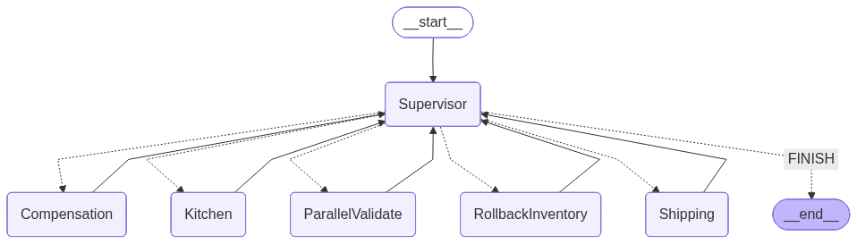

# 🍔 AI Food Fulfillment Supervisor Concurrency Monitor
**AI Food Fulfillment Supervisor Concurrency Monitor** is a high-concurrency order pipeline built on an asynchronous **LangGraph** framework that uses a centralized **Supervisor Pattern** to safely manage multiple concurrent users. Powered by **Google Gemini 3.1 flash lite**, the supervisor acts as an orchestration brain that reviews state telemetry at each step, passing control to specialized fulfillment nodes like **ParallelValidate** for atomic file-system spin-locking and customer card billing validation, **Kitchen** for permanent ledger deductions, and **Shipping** for final transport dispatch. By linking these processes natively with non-blocking runtimes (asyncio.gather and .ainvoke), the system instantly flags multi-user race conditions, routing conflicting traffic to automated Saga compensation nodes to clean up file-lock footprints while successfully fulfilling valid orders without data corruption.

Powered by **Streamlit**, **LangChain**, **LangGraph** and **Google Gemini 3.1 flash lite**.

### 🤖 System Architecture

#### 1. Asynchronous Multi-User Orchestration Pipeline
To mirror production workloads where multiple customers submit orders simultaneously, the platform implements non-blocking execution contexts at the entry gateway:
* **Parallel Graph Invocations**: The system backend harnesses `asyncio.gather` within a single FastAPI request lifecycle to trigger independent, isolated workflow sessions simultaneously.
* **Native Async Engine Execution**: By processing operations using LangGraph's asynchronous invocation framework (`app.ainvoke`), the server executes state transitions natively without locking up systemic thread channels.

#### 2. Centralized Supervisor Orchestration Pattern
Instead of using a decentralized, event-driven approach, this project relies on a strict **Orchestrator Saga Design Pattern**:
* **The Telemetry Brain Node (`supervisor_node`)**: A central supervisor acts as the manager of the entire order state machine, auditing data flags (`inventory_log`, `billing_log`, `cooked`, `order_shipped`) at the close of every atomic step.
* **Structured Semantic Routing**: Constrained by Pydantic models through Google Gemini (`with_structured_output`), the LLM acts as a deterministic decision boundary, generating precise node target values (`ParallelValidate`, `Kitchen`, `Compensation`, `Shipping`, `FINISH`).

#### 3. Spin-Lock Concurrency Barriers & Saga Compensations
Because distributed architectures lack global database-level ACID parameters, data consistency is enforced via explicit lock validation and compensation routines:
* **Atomic Concurrency Barriers**: 
The `ParallelValidate` node initiates concurrent checks via `asyncio.gather` to manage both payment card verification and inventory locking. The underlying `CSVInventoryLockManager` uses an exclusive OS file-creation flag (`x` mode) as a rigid barrier. If two instances enter at the same millisecond, the second instance hits an explicit `FileExistsError` and safely marks its internal telemetry tracking log as `CONFLICT_LOCKED`.
* **Compensating Rollbacks**: If downstream validations drop (such as a billing refusal), the supervisor routes directly to `Compensation`, using the customer's unique `inventory_token` uuid to release the lease via an explicit file teardown (`release_lock()`).





Open your terminal and type
python3 -m venv <your-environment-name>
source <your-environment-name>/bin/activate

We are using Google Gemni Model LLM(gemini-3.1-flash-lite) here.

Paste the api keys in the .env folder created at the root level of your project
1. Go to Google AI Studio and get the api key https://aistudio.google.com/api-keys
GOOGLE_API_KEY="<YOUR_API_KEY>"

2. Go to https://smith.langchain.com/ and get the API KEY
LANGCHAIN_API_KEY="<YOUR_API_KEY>"

### How to run Backend applications ?.
```
uvicorn <module-name>:<app-instance-name> --reload --port <port-number>
```

module-name: The name of your Python script file without the .py extension (e.g., main).
app-instance-name: The variable inside that file where you initialized your application instance (e.g., backend_app = FastAPI()).port-number: The network port address you want the server to listen on (e.g., 8000).

### How to run Streamlit applications ?.
Open terminal and type:
```
streamlit run "<project-name>"
```